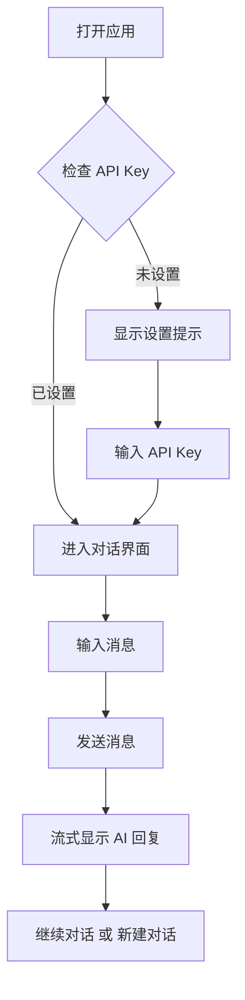

# 产品需求文档 - DeepSeek AI 对话应用

## 1. 产品概述

一个优雅的 AI 对话界面，无缝对接 DeepSeek 大语言模型，提供流畅的智能对话体验。

- 简洁现代的对话界面，支持多轮上下文对话
- 支持流式输出，实时显示 AI 思考过程
- 深度定制设计语言，区别于传统 AI 对话界面

## 2. 核心功能

### 2.1 功能模块

1. **对话界面**: 现代化的聊天界面，左侧对话历史列表，右侧主对话区域
2. **消息发送**: 支持 Enter 发送，Shift+Enter 换行，支持 Markdown 渲染
3. **对话管理**: 新建对话、删除对话、清空历史
4. **流式响应**: 支持 AI 回答流式输出，逐字显示
5. **上下文记忆**: 保持多轮对话上下文连贯性

### 2.2 页面详情

| 页面名称 | 模块名称 | 功能描述 |
|---------|---------|---------|
| 对话页面 | 侧边栏 | 展示历史对话列表，支持新建/删除对话 |
| 对话页面 | 消息区域 | 展示用户消息和 AI 回复，支持 Markdown 渲染 |
| 对话页面 | 输入区域 | 文本输入框，支持发送按钮和清空按钮 |
| 设置弹窗 | API 配置 | DeepSeek API Key 输入和保存 |

## 3. 核心流程

用户打开应用 → 输入 API Key → 开始对话 → 发送消息 → 接收 AI 回复 → 继续对话

## 4. 用户界面设计

### 4.1 设计风格

- **主题**: 深色极简主义，带有柔和的霓虹点缀
- **主色调**: 深蓝灰底色 `#0f1419`，配合青色/蓝绿渐变强调色 `#00d4aa → #0ea5e9`
- **按钮样式**: 圆角胶囊按钮，带有微妙的光晕效果
- **字体**: JetBrains Mono (代码), Noto Sans SC (中文)
- **布局**: 左侧固定侧边栏 + 右侧自适应对话区域

### 4.2 页面设计概述

| 页面名称 | 模块名称 | UI 元素 |
|---------|---------|---------|
| 对话页面 | 侧边栏 | 宽度 280px，深色背景，新建按钮，对话列表项 |
| 对话页面 | 消息气泡 | 用户消息右对齐深色，AI 消息左对齐带渐变边框 |
| 对话页面 | 输入区域 | 圆角输入框，发送按钮带动画效果 |

### 4.3 响应式设计

- 桌面端: 侧边栏固定显示
- 移动端: 侧边栏可收起，点击切换显示
