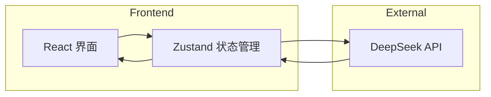
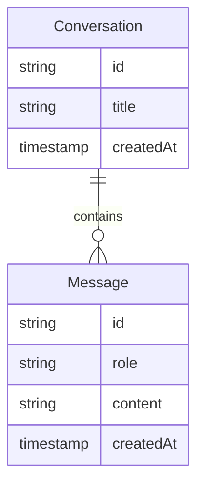

# 技术架构文档 - DeepSeek AI 对话应用

## 1. 架构设计



## 2. 技术栈

- **前端框架**: React@18 + TypeScript
- **构建工具**: Vite
- **样式方案**: Tailwind CSS
- **状态管理**: Zustand
- **Markdown 渲染**: react-markdown
- **代码高亮**: Prismjs
- **图标库**: Lucide React

## 3. 路由定义

| 路由 | 用途 |
|-----|-----|
| / | 单页应用，对话主界面 |

## 4. API 定义

### 4.1 DeepSeek Chat API

**请求**
```typescript
interface ChatRequest {
  model: string;           // "deepseek-chat"
  messages: Message[];
  stream: boolean;         // 是否使用流式响应
}

interface Message {
  role: "user" | "assistant" | "system";
  content: string;
}
```

**响应 (流式)**
```typescript
interface ChatResponse {
  choices: [{
    delta: { content: string };
    finish_reason: string | null;
  }];
}
```

### 4.2 本地存储

| Key | 类型 | 用途 |
|-----|-----|-----|
| deepseek_api_key | string | API 密钥 |
| conversations | Conversation[] | 对话历史 |

## 5. 数据模型



## 6. 组件结构

```
src/
├── components/
│   ├── Sidebar.tsx          # 侧边栏组件
│   ├── ChatMessage.tsx     # 消息气泡组件
│   ├── ChatInput.tsx        # 输入框组件
│   ├── MarkdownRenderer.tsx # Markdown 渲染器
│   └── SettingsModal.tsx   # 设置弹窗
├── hooks/
│   ├── useChat.ts          # 对话逻辑 hook
│   └── useLocalStorage.ts  # 本地存储 hook
├── store/
│   └── chatStore.ts        # Zustand 状态管理
├── pages/
│   └── Home.tsx            # 主页面
├── utils/
│   └── api.ts              # DeepSeek API 调用
└── App.tsx
```
